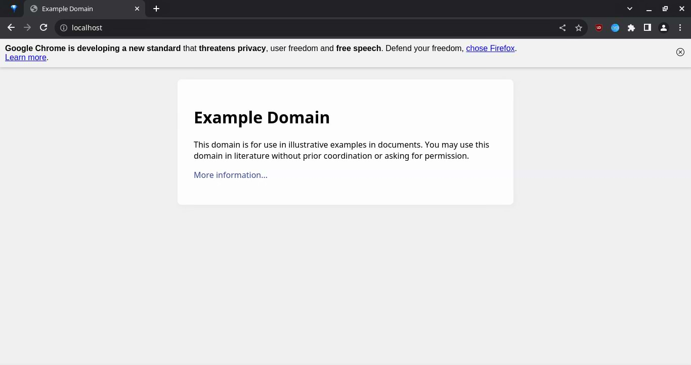

# AgainstWebIntegrityJs

A simple script that you can embed on your website to support the cause!



> The image provided above is for demonstration purposes only. example.com does NOT use this script and is not affiliated with this project in any way.

## Usage

Download the script or build it yourself, and place it **as a module** just before the closing `</body>` tag.

For example:

```html
<!DOCTYPE html>
<html>
    <head>
        <meta charset="utf-8" />
        <meta name="viewport" content="width=device-width, initial-scale=1" />
        <title>Example Page</title>
    </head>
    <body>
        <div>
            <h1>Example Page</h1>
            <p>Lorem ipsum...</p>
        </div>
        <script type="module" src="AgainstWebIntegrity.js"></script>
    </body>
</html>
```

### Behavior

By default, the script shows the dialog only in Chrome or Chromium desktop browsers. Once closed, the dialog is never presented again to the user on that particular website (unless the `localStorage` variable `ChromeWebIntegrityWarningClosed` is cleared).

You can easily modify the script since all the conditions are present within the initial `if` statement.

## Building

This script depends on [UAParser](https://faisalman.github.io/ua-parser-js/) and [Deno](https://deno.land/).

1. Install Deno and its dependencies.

2. Use `deno bundle` to bundle the script with UAParser. For example: `deno bundle script.js AgainstWebIntegrity.js`.
